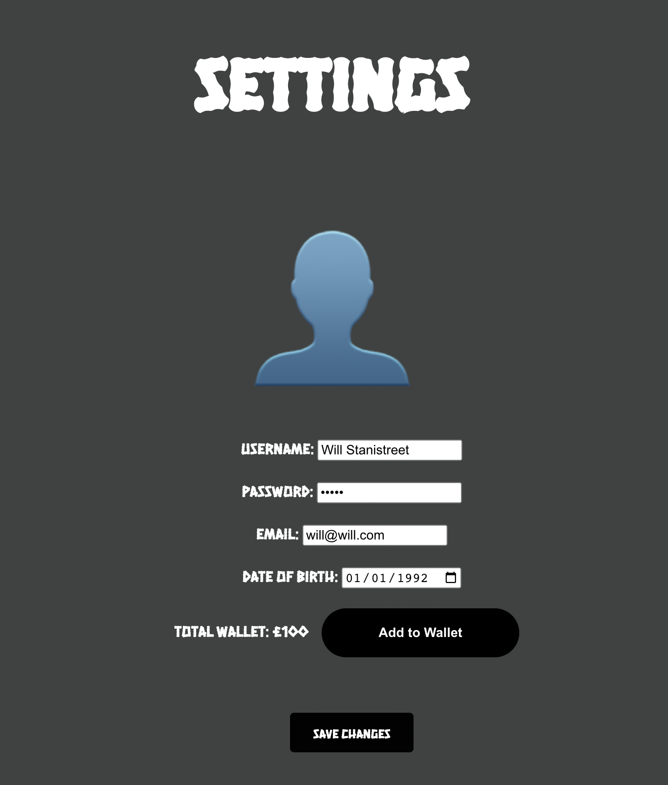
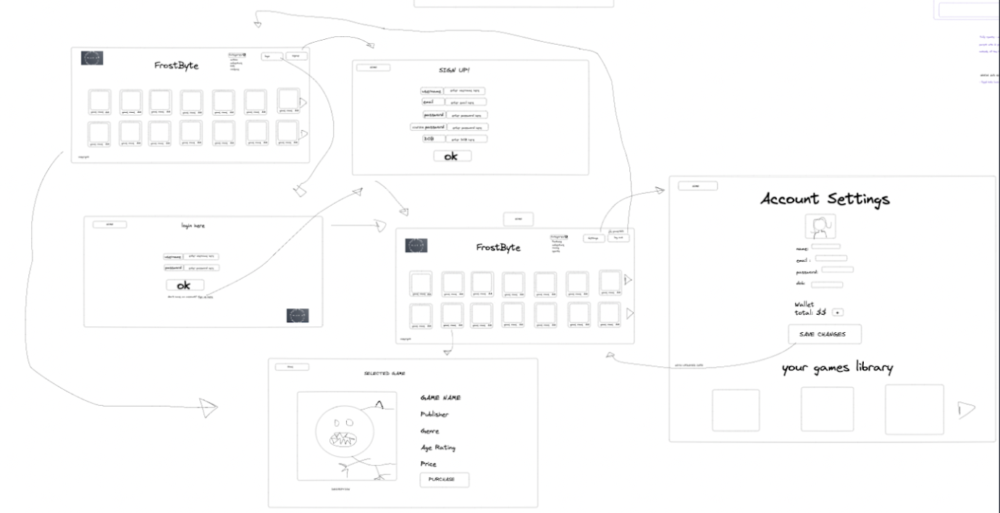

# Team Negative Infinity

## Project Description

We wanted to create an online video Game E-commerce website using the Game Launcher Backend project we were provided.
This application allows you to do various things such as browse games, signup or login and then purchase games which are then stored on your account!

## Instructions
First the Backend needs to be installed. Instructions for that are on the [Game Launcher](https://github.com/wjstanistreet/FrostByte_game_launcher) repo.

This project was bootstrapped with [Create React App](https://github.com/facebook/create-react-app).
After cloning the react app, make sure you download the neccessary modules using the command `npm install` in the terminal within the cloned repo.
Then you can start the app using the command `npm start` which will take you to your browser to view the website.

# Tour of the website

## Home page

When the user opens our website, they our introduced to what is seen above. The user can scroll down to browse games and there is a search filter to assist them.

## Specific game
A user can click on the more details button on a game to view that specific game in more detail.

## Login/Signup
From the home page, the user is able to login or signup by clicking the associated button in the nav bar.

Simply fill out the appropiate details and click the button to proceed to the logged in page.

## Logged in
After the user has logged or signed in to an account, they will be returned back to the home page but this time the nav bar is slightly different.
The users username is displayed as well as different buttons in the nav bar that are unique to someone with an account.

## Purchase Game
When a user now clicks on a specific game, they are given the option to add the game to their cart.

By simply clicking on the cart button, a popup displaying your balance, the game cost and an option to purchase appears.
If the user purcahses the game, the user now has the option to play the game.

## Settings
Finally, a user has the option to change their account details in the settings page

# Plan
We began this project by planning what we want to create using Excalidraw. Below is a picture of our wireframe and our plan.

Additionally, we managed our tasks using Trello to split them between the group as well as see what we need to complete that day.

## MVP 
Our MVP for this project was just the games and users section as shown below.

Games:
- Display all games
- Categorical display
- More info on a specific game (unique page for a game)
- Filtered searches

Users:
- Login
- Signup
- Log out

## Extensions
For our extensions, we wanted to:
- See games user already owns
- Purchase games
- See other users who play the game
- Implement friendlist

We managed to complete all the extensions except the friendlist.

## Future plans

- Add friendlist
- View someone elses account page
- Achievement system.

## Thank you

Thank you to all the trainers that helped us with the project!

